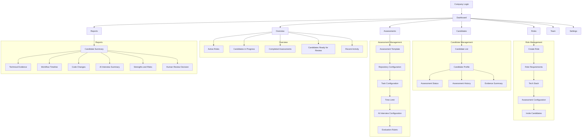
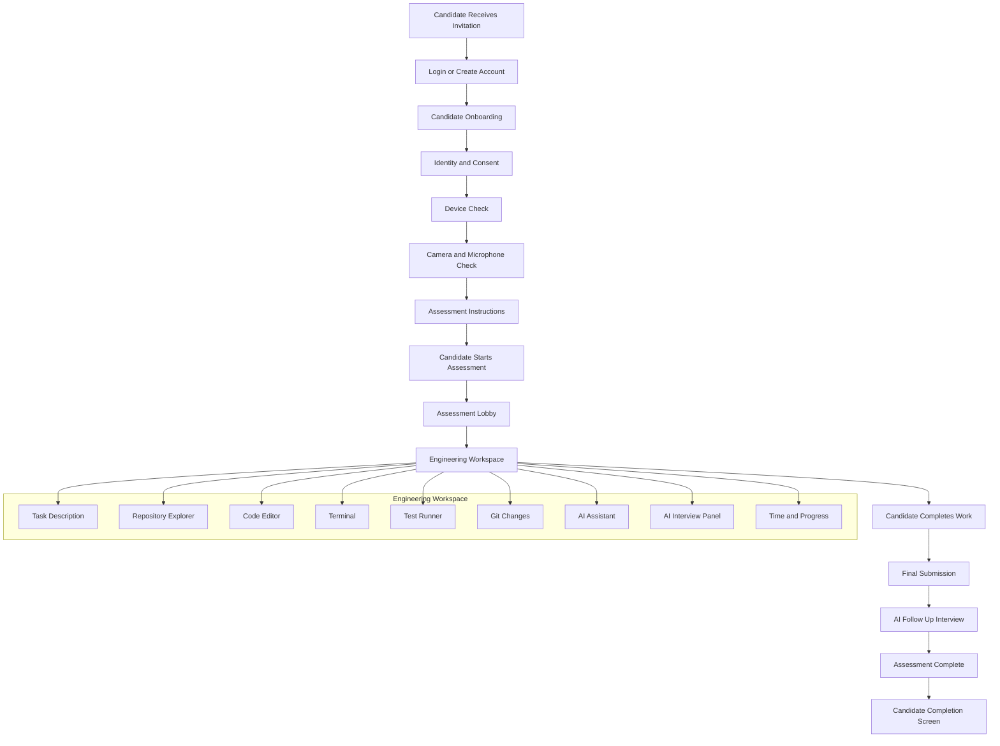
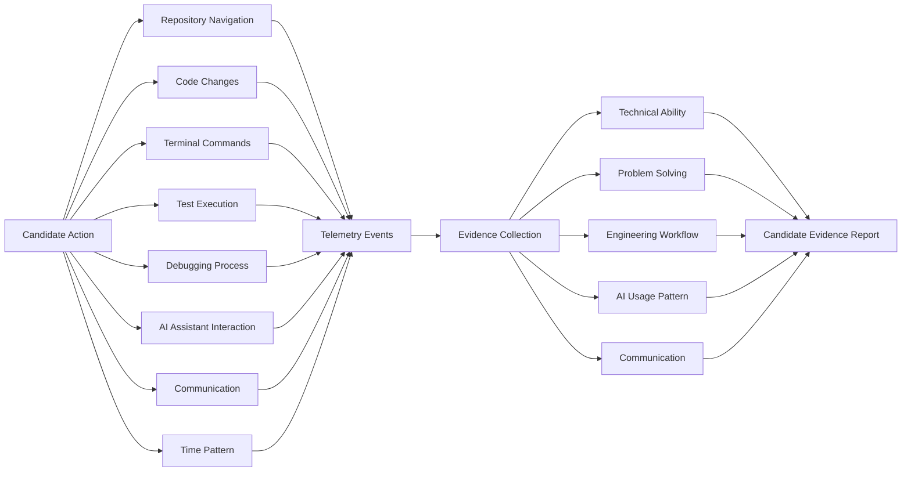
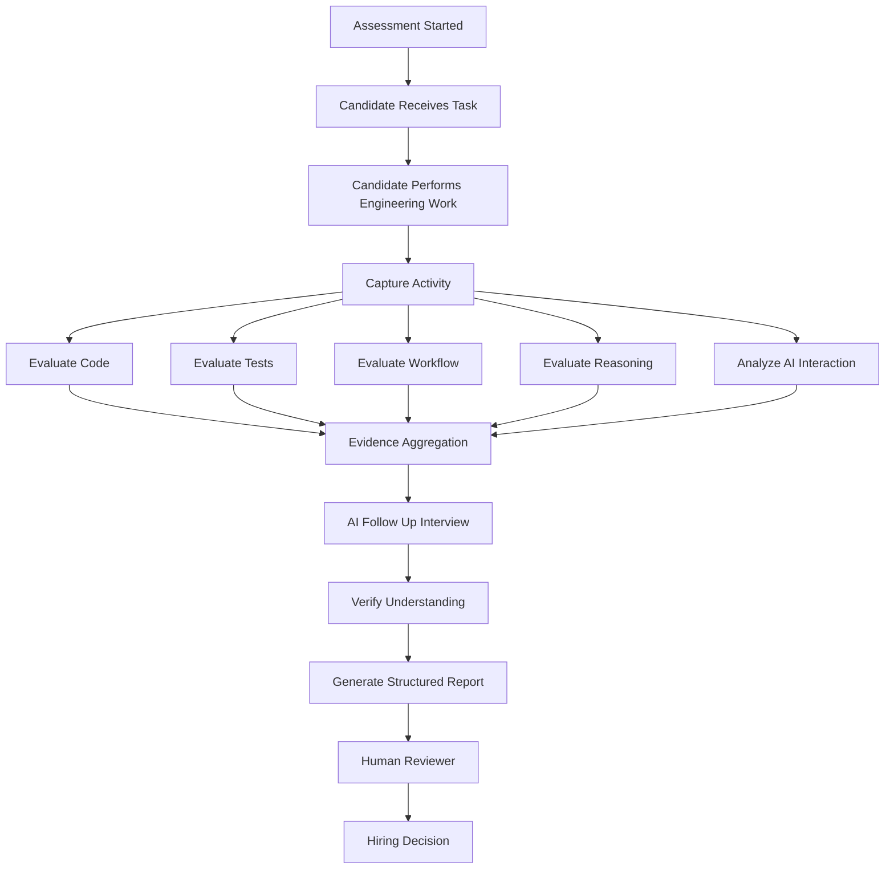
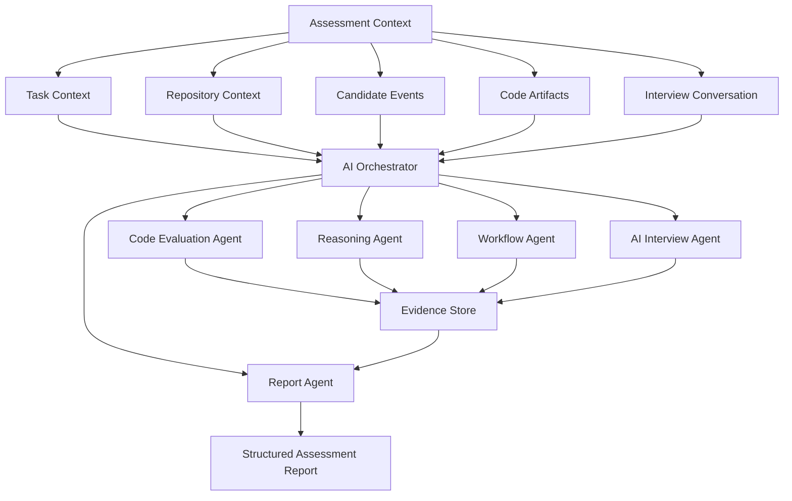
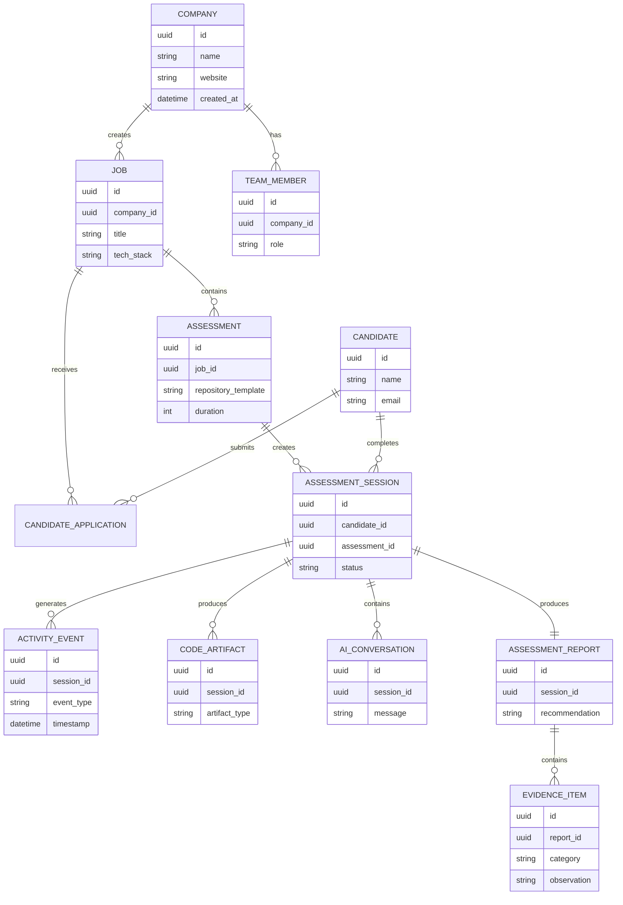
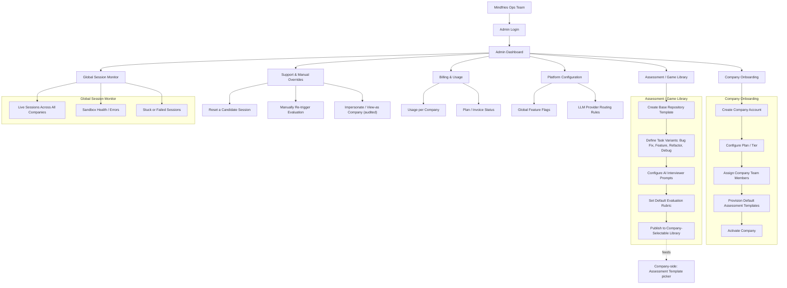

# Mindfries — System Architecture & Product Requirements Document

**Product:** Mindfries — AI Hiring Intelligence Platform
**Document type:** System Architecture (complete) + PRD (tech stack & MVP scope)
**Status:** Architecture finalized for MVP, including Internal Admin Portal · Tech stack finalized — Database (Supabase) and Frontend Hosting (Vercel) confirmed 2026-08-30 — one item still open (see 2.4)

---

## How to read this document

This document has two parts, deliberately kept separate:

- **Part 1 — Complete System Architecture.** The full blueprint of the product: every portal, layer, flow, and data model, independent of which specific technologies implement them. This is the shared mental model the whole team should hold before any code is written.
- **Part 2 — PRD: Scope & Tech Stack.** What we're actually building for the MVP, and the concrete technology choices for each layer in Part 1. The MVP scope is defined below; **the tech stack table is intentionally left open** — see the questions at the end — so the stack reflects an actual founder decision, not a default.

---

# Part 1 — Complete System Architecture

## 1.1 Design Approach

The platform is structured around **three portals** sitting on a shared core:

- **Company / Admin Portal** — the customer-facing side: creates roles, configures assessments, invites candidates, reviews evidence.
- **Candidate Portal** — completes onboarding and performs a realistic engineering assessment.
- **Internal Admin Portal (Mindfries team only)** — our own operations panel: onboards new companies, authors and maintains the assessment/"game" library that companies select from, monitors sessions globally, and handles support overrides. This is not visible to customers.

Between the customer-facing portals sits the **Assessment Intelligence Layer** — the part of the system that orchestrates the sandbox, the AI interviewer, telemetry capture, evaluation, and reporting. The Internal Admin Portal sits alongside it, with elevated access into the same core platform and data layer.

For the MVP, the architecture is deliberately scoped around **the assessment problem**. The broader organisational-intelligence and historical high-performer learning loop (Phase 0 and Phase 8 from the product vision) are designed in, but built as later layers — see Part 2 for exact MVP boundaries.

## 1.2 Complete Product Architecture

```mermaid
flowchart TB

    subgraph USERS["Users"]
        CA["Company Admin"]
        HM["Hiring Manager"]
        IC["Interviewer / Reviewer"]
        C["Candidate"]
        OPS["Mindfries Ops Team"]
    end

    subgraph ADMIN_PORTAL["Internal Admin Portal (Mindfries Team)"]
        ADASH["Ops Dashboard"]
        ONBOARD["Company Onboarding"]
        GAMELIB["Assessment / Game Library"]
        GMONITOR["Global Session Monitor"]
        SUPPORT["Support & Overrides"]
        BILLING["Billing & Usage"]
    end

    subgraph COMPANY_PORTAL["Company Portal"]
        DASH["Company Dashboard"]
        JOBS["Roles and Jobs"]
        CANDIDATES["Candidate Management"]
        ASSESSMENTS["Assessment Management"]
        REPORTS["Assessment Reports"]
        TEAM["Team and Access Management"]
        SETTINGS["Company Settings"]
    end

    subgraph CANDIDATE_PORTAL["Candidate Portal"]
        CON["Candidate Onboarding"]
        PROFILE["Candidate Profile"]
        INVITE["Assessment Invitation"]
        PREP["Pre Assessment Setup"]
        WORKSPACE["Engineering Workspace"]
        INTERVIEW["AI Interview"]
        SUBMIT["Submission and Completion"]
    end

    subgraph CORE_PLATFORM["Core Platform"]
        AUTH["Authentication and Authorization"]
        API["Application API"]
        ORCH["Assessment Orchestrator"]
        EVENT["Event and Telemetry Engine"]
        EVAL["Evaluation Engine"]
        REPORT_ENGINE["Report Generation Engine"]
        NOTIFY["Notification Service"]
    end

    subgraph ASSESSMENT_ENVIRONMENT["Assessment Environment"]
        SANDBOX["Isolated Candidate Sandbox"]
        IDE["Web IDE"]
        FILES["File System"]
        TERMINAL["Terminal"]
        REPO["Assessment Repository"]
        TESTS["Automated Test Runner"]
        GIT["Git and Diff Tracking"]
        AI_AGENT["AI Coding Assistant"]
    end

    subgraph AI_LAYER["AI Intelligence Layer"]
        AI_INTERVIEWER["AI Interviewer"]
        AI_REASONING["Reasoning Analysis"]
        AI_CODE["Code Evaluation"]
        AI_BEHAVIOR["Workflow Analysis"]
        AI_COMMUNICATION["Communication Analysis"]
        AI_SCORING["Evidence and Scoring"]
    end

    subgraph DATA["Data Layer"]
        COMPANY_DB["Company Data"]
        CANDIDATE_DB["Candidate Data"]
        ASSESSMENT_DB["Assessment Data"]
        EVENT_DB["Activity and Telemetry"]
        ARTIFACT_DB["Code and Session Artifacts"]
        VECTOR_DB["Knowledge and Context"]
    end

    subgraph EXTERNAL["External Services"]
        EMAIL["Email Service"]
        VIDEO["Camera and Audio Service"]
        LLM["LLM Provider"]
        CLOUD["Cloud Sandbox Infrastructure"]
        SSO["Identity Provider"]
    end

    CA --> DASH
    HM --> DASH
    IC --> REPORTS
    C --> CON
    OPS --> ADASH

    ADASH --> ONBOARD
    ADASH --> GAMELIB
    ADASH --> GMONITOR
    ADASH --> SUPPORT
    ADASH --> BILLING

    DASH --> JOBS
    DASH --> CANDIDATES
    DASH --> ASSESSMENTS
    DASH --> REPORTS
    DASH --> TEAM
    DASH --> SETTINGS

    CON --> PROFILE
    PROFILE --> INVITE
    INVITE --> PREP
    PREP --> WORKSPACE
    WORKSPACE --> INTERVIEW
    INTERVIEW --> SUBMIT

    COMPANY_PORTAL --> AUTH
    CANDIDATE_PORTAL --> AUTH
    ADMIN_PORTAL --> AUTH

    AUTH --> API
    API --> ORCH

    ORCH --> SANDBOX
    ORCH --> EVENT
    ORCH --> NOTIFY

    SANDBOX --> IDE
    SANDBOX --> FILES
    SANDBOX --> TERMINAL
    SANDBOX --> REPO
    SANDBOX --> TESTS
    SANDBOX --> GIT
    SANDBOX --> AI_AGENT

    EVENT --> EVAL

    EVAL --> AI_INTERVIEWER
    EVAL --> AI_REASONING
    EVAL --> AI_CODE
    EVAL --> AI_BEHAVIOR
    EVAL --> AI_COMMUNICATION
    EVAL --> AI_SCORING

    AI_SCORING --> REPORT_ENGINE
    REPORT_ENGINE --> REPORTS

    API --> COMPANY_DB
    API --> CANDIDATE_DB
    ORCH --> ASSESSMENT_DB
    EVENT --> EVENT_DB
    SANDBOX --> ARTIFACT_DB
    AI_LAYER --> VECTOR_DB

    ONBOARD --> COMPANY_DB
    GAMELIB --> ASSESSMENT_DB
    GMONITOR --> EVENT_DB
    GMONITOR --> ARTIFACT_DB
    SUPPORT --> ASSESSMENT_DB
    BILLING --> COMPANY_DB

    NOTIFY --> EMAIL
    INTERVIEW --> VIDEO
    AI_LAYER --> LLM
    SANDBOX --> CLOUD
    AUTH --> SSO
```

## 1.3 The Core User Flow

This is the heart of the MVP. A company should never feel like it's operating a complicated recruitment system:

> **Create role → choose assessment → invite candidate → watch evidence → make decision.**

A candidate should never feel like they're sitting an exam:

> **Enter → understand the task → work like a real engineer → explain decisions → finish.**

```mermaid
flowchart LR

    A["Company Creates Role"]
    B["Configures Assessment"]
    C["Selects Repository and Task"]
    D["Invites Candidate"]
    E["Candidate Completes Setup"]
    F["Candidate Enters Engineering Environment"]
    G["Candidate Works on Task"]
    H["System Captures Work Evidence"]
    I["AI Interview and Follow Up Questions"]
    J["Automated Evaluation"]
    K["AI Generates Evidence Report"]
    L["Hiring Team Reviews"]
    M["Human Hiring Decision"]

    A --> B
    B --> C
    C --> D
    D --> E
    E --> F
    F --> G
    G --> H
    H --> I
    I --> J
    J --> K
    K --> L
    L --> M
```

## 1.4 Company Admin Dashboard Architecture

The company dashboard has to stay disciplined. **Mindfries is not a Greenhouse competitor** — the dashboard revolves entirely around the assessment lifecycle, not general applicant-tracking workflow.

## 1.5 Candidate Application Architecture

The candidate side has to feel simple — never like an exam platform. The framing that should hold at every screen:

> *"I have been given an engineering problem. Here is the environment. Solve it the way you normally would."*

## 1.6 Engineering Workspace Architecture

This is the single most important screen in the product — it should feel conceptually like a real developer environment, not a test-taking UI.

```mermaid
flowchart TB

    WORKSPACE["Candidate Engineering Workspace"]

    WORKSPACE --> HEADER["Header"]
    WORKSPACE --> LEFT["Left Panel"]
    WORKSPACE --> CENTER["Main Workspace"]
    WORKSPACE --> RIGHT["AI Panel"]
    WORKSPACE --> BOTTOM["Terminal and Output"]

    HEADER --> H1["Assessment Name"]
    HEADER --> H2["Timer"]
    HEADER --> H3["Assessment Status"]
    HEADER --> H4["Submit"]

    LEFT --> L1["Task Description"]
    LEFT --> L2["File Explorer"]
    LEFT --> L3["Repository Information"]
    LEFT --> L4["Git Changes"]

    CENTER --> C1["Code Editor"]
    CENTER --> C2["Diff Viewer"]
    CENTER --> C3["Test Results"]

    RIGHT --> R1["AI Coding Assistant"]
    RIGHT --> R2["AI Interviewer"]
    RIGHT --> R3["Conversation History"]

    BOTTOM --> B1["Terminal"]
    BOTTOM --> B2["Command Output"]
    BOTTOM --> B3["Test Logs"]
```

## 1.7 What the System Observes — the Evidence Model

This is where Mindfries actually differs from a scored test. The system does **not** evaluate:

> Final code → score.

It captures evidence continuously, across the whole session:

The distinction matters. Mindfries should never say only:

> "Candidate scored 82."

It should be able to say:

> "The candidate first explored the authentication flow, identified the relevant module, reproduced the issue locally, used tests to validate the hypothesis, made three focused changes, and successfully resolved the failing test."

**That is evidence — and it's the product's core differentiator.**

## 1.8 Assessment Evaluation Pipeline

## 1.9 AI Architecture — Specialized Agents, Not One Giant Model

Deliberately not one monolithic agent. Each concern is a separate, composable component:

## 1.10 Data Architecture

## 1.11 Internal Admin Portal — Our Own Operations Panel

This is Mindfries' internal tool, not customer-visible. It's how our own team onboards companies, authors and maintains the assessment "games" that companies choose from, and keeps an eye on the platform globally — instead of doing any of that by hand in a database.

The **Game Library** is the key idea here: rather than every company building its own assessment tasks from scratch, Mindfries centrally authors and curates the base repository templates, task variants, interviewer prompts, and default rubrics. Companies then pick from and lightly customise this library on their side (Section 1.4, `A1 — Assessment Template`), which keeps assessment quality consistent and lets us improve every company's assessments at once.

---

## 2.1 MVP Scope

The complete architecture in Part 1 is the long-term system. **The first PRD does not implement all of it.** MVP scope is deliberately narrow:

**Company**
1. Sign up.
2. Create a role.
3. Select or configure an assessment.
4. Invite a candidate.
5. See assessment status.
6. Review an evidence-based report.

**Candidate**
1. Accept invitation.
2. Complete basic setup.
3. Enter the coding environment.
4. Read the task.
5. Modify a real codebase.
6. Use terminal and tests.
7. Interact with an AI assistant.
8. Complete an AI follow-up interview.
9. Submit.

**Platform**
1. Provision an isolated sandbox.
2. Track candidate events.
3. Run tests.
4. Store code changes.
5. Generate evaluation evidence.
6. Generate a final report.

**Internal Admin (Mindfries team)**
1. Onboard a new company account and assign its team.
2. Author and publish base assessment templates ("games") to the shared library.
3. View live and past sessions across all companies in one place.
4. Reset a stuck session / manually re-trigger evaluation as a support action.

Explicitly **out of scope for MVP**: multi-platform job publishing (Phase 1 of the product vision), organisational knowledge-base ingestion (Phase 0), behavioural/cultural evaluation (Phase 4), background verification (Phase 7), and the continuous-learning/Success-DNA loop (Phase 8). These stay in the architecture as designed layers, built after MVP validation. Billing automation and platform-wide feature flags (shown in Section 1.11) can also wait — manual, ops-run versions are enough until there are paying companies to bill.

## 2.2 Core Product Principle

> **The AI should not simply judge the candidate. It should collect evidence about how the candidate worked, and help the hiring team make a better decision.**

Every tech choice below should be judged against this principle — favor whatever lets us capture and explain evidence faithfully, over whatever is simplest to score.

## 2.3 Tech Stack — Finalized

| Architecture Layer | Component(s) | Chosen Technology | Notes |
|---|---|---|---|
| Web App | Company Portal, Candidate Portal, Internal Admin Portal | **Next.js + React + TypeScript** | One shared design system across all three portals |
| Code Editor | In-browser editor inside the sandbox | **Monaco Editor** | Closest browser experience to VS Code |
| Terminal | In-browser terminal | **xterm.js** | Real terminal-like experience in browser |
| Backend / API | Application API, Assessment Orchestrator, Admin Portal API | **FastAPI — monolith** | Excellent for AI orchestration and rapid MVP development |
| Real-time | Terminal streaming, live status, live events | **WebSocket** | Essential for terminal, status, and live events |
| Sandbox Infrastructure | Isolated candidate environments, terminal, file system | **Daytona** | Best fit for real development environments *(supersedes the earlier Docker-in-Docker call — Daytona likely runs on containers underneath, but is the managed layer we build against)* |
| AI / LLM Orchestration | Multi-agent orchestrator (code, reasoning, workflow, interview, report agents) | **Multi-LLM system**, routed per agent | Routing proposal below still pending confirmation |
| LLM Providers | Reasoning, code evaluation, report generation | **Claude** | Proposed: primary agent for code evaluation, reasoning, and report generation |
| LLM Providers | Multimodal / vision RAG | **Gemini** | Proposed: vision RAG (e.g., screen/diagram understanding) and multimodal context |
| LLM Providers | AI Interviewer voice | **ElevenLabs** | Proposed: text-to-speech / speech-to-text for the live AI interview |
| Database | Company, candidate, job, assessment records | **Supabase (PostgreSQL)** | Managed Postgres — also gives us Auth, Storage, and Realtime primitives out of the box if we want them later |
| Vector / Knowledge Store | Context for AI agents, vision RAG | **pgvector via Supabase** | Same database as primary store — no separate vector DB for MVP |
| Cache / Realtime State | Session state, queues, rate limiting | **Redis** | Fast session state, queues and rate limiting |
| Telemetry / Event Pipeline | Activity event capture during assessments | **Redis Streams → ClickHouse later** | Fast event ingestion now, without Kafka complexity; migrate to ClickHouse as volume grows |
| Artifact Storage | Code changes, session artifacts | **Amazon S3** | Reliable and cheap for session artifacts *(revisit vs. Supabase Storage once artifact size/volume is clearer — see 2.4)* |
| Video / Audio | Camera & mic checks, proctoring signal, live AI interview | **LiveKit + WebRTC** | Low-latency real-time audio/video |
| Authentication & Authorization | Company, candidate, and internal admin auth | **Clerk (MVP)** | Fastest path to secure auth; revisit if Internal Admin needs more granular roles than Clerk's org model gives out of the box |
| Email | Transactional & notification email | **Resend** | Simple, developer-focused email infrastructure |
| Hosting & Deployment | Web app (Next.js: Company, Candidate, Internal Admin portals) | **Vercel** | First-class Next.js hosting, instant preview deployments per PR |
| Hosting & Deployment | Backend (FastAPI monolith, WebSocket, sandbox orchestration) | **Open — see 2.4** | Vercel's serverless model doesn't fit a long-running FastAPI process, WebSocket connections, or Daytona orchestration; needs its own host (e.g. Railway, Fly.io, Render, or AWS) |
| CI/CD | Build & deploy pipeline | **GitHub Actions + Vercel** | Vercel handles frontend build/deploy; backend deploy target follows the decision above |
| Monitoring | Errors, distributed tracing | **Sentry + OpenTelemetry** | |
| Assessment / Game Library | Internal Admin authoring tools | **Same stack** (Next.js/TS + FastAPI + Supabase) | No separate system — lives inside the monolith and shared frontend |

## 2.4 Still Open

The stack is now essentially final. A few smaller items remain:

1. **LLM-per-agent routing** — Claude / Gemini / ElevenLabs mapping above is still a proposal; confirm or adjust the split.
2. **Testing infra inside the sandbox** — Daytona likely provides a native way to run the automated test suite per submission; worth confirming rather than assuming, since it affects the Evaluation Pipeline (Section 1.8).
3. **Team ownership** — with Disha (CTO) leading engineering, is there a split you want reflected here (e.g., who owns the sandbox/orchestrator vs. the AI agent layer vs. the frontend)?
4. **Backend hosting target** — now that the frontend is confirmed on Vercel, where does the FastAPI monolith (WebSocket terminal streaming, Daytona sandbox orchestration) actually run? Vercel serverless functions aren't a fit for long-lived connections; pick a host (Railway, Fly.io, Render, or an AWS box) before build starts.
5. **Artifact storage: S3 vs. Supabase Storage** — now that Supabase is the primary database, worth a quick call on whether code/session artifacts also live in Supabase Storage (one less vendor) or stay on S3 (already listed above) — no functional difference for MVP, purely an ops-simplicity question.

Once those are confirmed, this document is ready to be treated as final for build planning.
